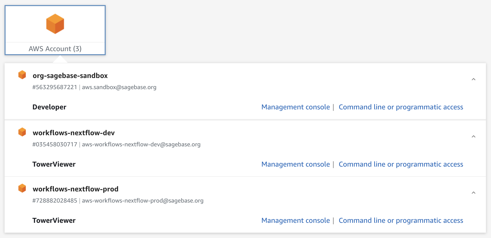

# Nextflow Infrastructure

The AWS infrastructure for hosting a [private instance](https://tower.sagebionetworks.org) of [Nextflow Tower](https://tower.nf/) and executing [Nextflow workflows](https://nextflow.io/) is defined in this repository and deployed using [CloudFormation](https://aws.amazon.com/cloudformation/) via [Sceptre](https://sceptre.cloudreach.com/).

➡️ **Nextflow Tower for Sage Bionetworks:** https://tower.sagebionetworks.org

## Getting Started

### Prospective Tower Users

Follow the [Tower User Onboarding](#tower-user-onboarding) instructions below. Access is currently restricted to Sage Bionetworks staff.

### Prospective Contributors

Read through the [contribution guidelines](CONTRIBUTING.md) for more information. Contributions are welcome from anyone!

## Tower User Onboarding

1. Determine what is known as the stack name by concatenating the project name with the suffix `-project` (_e.g._ `imcore-project`, `amp-ad-project`, `commonmind-project`).

   **N.B.:** Anytime that `<stack_name>` appears below with the angle brackets, replace the placeholder with the actual stack name, omitting any angle brackets.

2. Install [AWS CLI v2](https://docs.aws.amazon.com/cli/latest/userguide/install-cliv2.html) and [Docker](https://docs.docker.com/engine/install/) on your local computer or on a server available to you.

3. [Create](https://sagebionetworks.jira.com/jira/software/c/projects/IT/issues/) an IT JIRA ticket requesting membership to the following JumpCloud groups for anyone who needs read/write or read-only access to the S3 bucket:

   - `aws-sandbox-developers`
   - `aws-workflow-nextflow-tower-viewer`

   To confirm whether you're already a member of these JumpCloud groups, you can expand the AWS Account list on [this page](https://d-906769aa66.awsapps.com/start#/) (after logging in with JumpCloud) and check if you have `Developer` listed under `org-sagebase-sandbox` and `TowerViewer` under `workflows-nextflow-dev` and `workflows-nextflow-prod`.

   

4. Open a pull request on this repository in which you duplicate [`config/prod/example-project.yaml`](config/prod/example-project.yaml) as `<stack_name>.yaml` in the `prod/` subdirectory and then follow the numbered steps listed in the file. Note that some steps are required whereas others are optional.

   **N.B.** In this case, read/write vs read-only access refers to the level of access granted to individuals for the encrypted S3 bucket that will be provisioned once the PR is merged.

   **Getting Help:** If you are unfamiliar with Git/GitHub or don't know how to open a pull request, message us in the [`#workflow_users`](https://sagebionetworks.slack.com/archives/C8SJHFCKT) Slack channel or email us at `nextflow-admins[at]sagebase[dot]org`.

5. Once the pull request is approved and merged, [confirm](https://github.com/Sage-Bionetworks-Workflows/aws-workflows-nextflow-infra/actions?query=event%3Apush+branch%3Amain) that your PR was deployed successfully and if so, open a terminal to perform the following steps:

   1. [Copy](https://d-906769aa66.awsapps.com/start#/) the temporary credentials for your Developer `sandbox` role, available under:
      ```
      AWS Accounts > org-sagebase-sandbox > Developer > Command line or programmatic access > Option 1
      ```
      Run the copied `export` commands in the terminal, which should look like this:
      ```
      export AWS_ACCESS_KEY_ID="..."
      export AWS_SECRET_ACCESS_KEY="..."
      export AWS_SESSION_TOKEN="..."
      ```

   2. [Create](https://tower.sagebionetworks.org/tokens) a new token in Nextflow Tower called `<stack_name>`, copy the token (which is only displayed once), and run the following command, updating `<token>` with the copied value:
      ```
      export NXF_TOWER_TOKEN="<token>"
      ```

   3. [Create](https://www.synapse.org/#!PersonalAccessTokens:) a new personal access token in Synapse called `<stack_name>` with all scopes enabled, copy the token (which is only displayed once), and run the following command, updating `<token>` with the copied value:
      ```
      export SYNAPSE_TOKEN="<token>"
      ```

   4. Run the following Docker command to configure your project in Nextflow Tower, updating `<stack_name>` with the stack name:
      ```
      docker run -e STACK_NAME="<stack_name>" -e AWS_ACCESS_KEY_ID -e AWS_SECRET_ACCESS_KEY -e AWS_SESSION_TOKEN -e NXF_TOWER_TOKEN -e SYNAPSE_TOKEN -v "$HOME/.aws:/root/.aws" sagebionetworks/setup-tower-project > project-config.json
      ```

      The above Docker command performs the following tasks:

      - In your AWS CLI configuration (`~/.aws/config`), it configures two profiles if they don't already exist:
        - `sandbox` for using the `Developer` role from the `sandbox` AWS account
        - `tower` for using the `TowerViewer` role from the `nextflow-prod` AWS account

        You can login using these profiles with the following commands
        ```
           aws --profile sandbox sso login
           aws --profile tower sso login
        ```

      - In Nextflow Tower, the credentials for the Forge service user were created under the name `<stack_name>`.

      - In Nextflow Tower, a compute environment was created using the above credentials under the name `<stack_name> (default)`. If you need to tweak the compute environment, we recommend that you clone the default one and make adjustments as necessary.

## License

This repository is licensed under the [Apache License 2.0](LICENSE).

Copyright 2021 Sage Bionetworks
